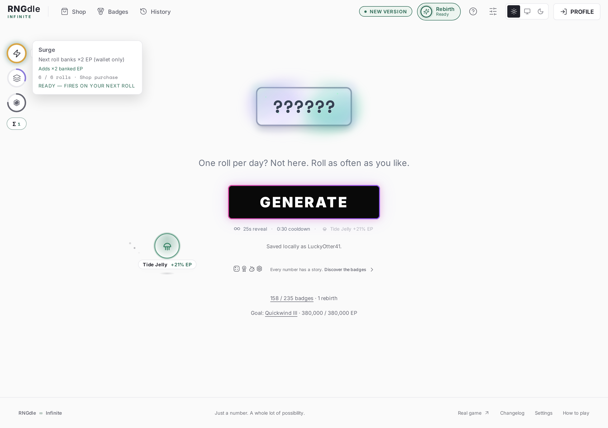
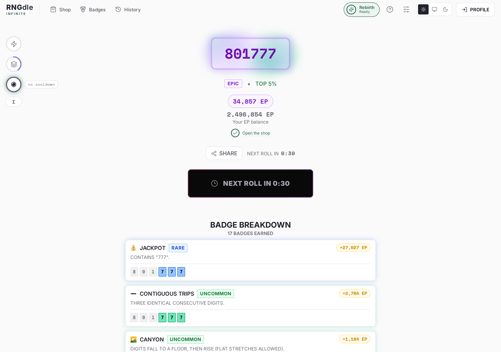
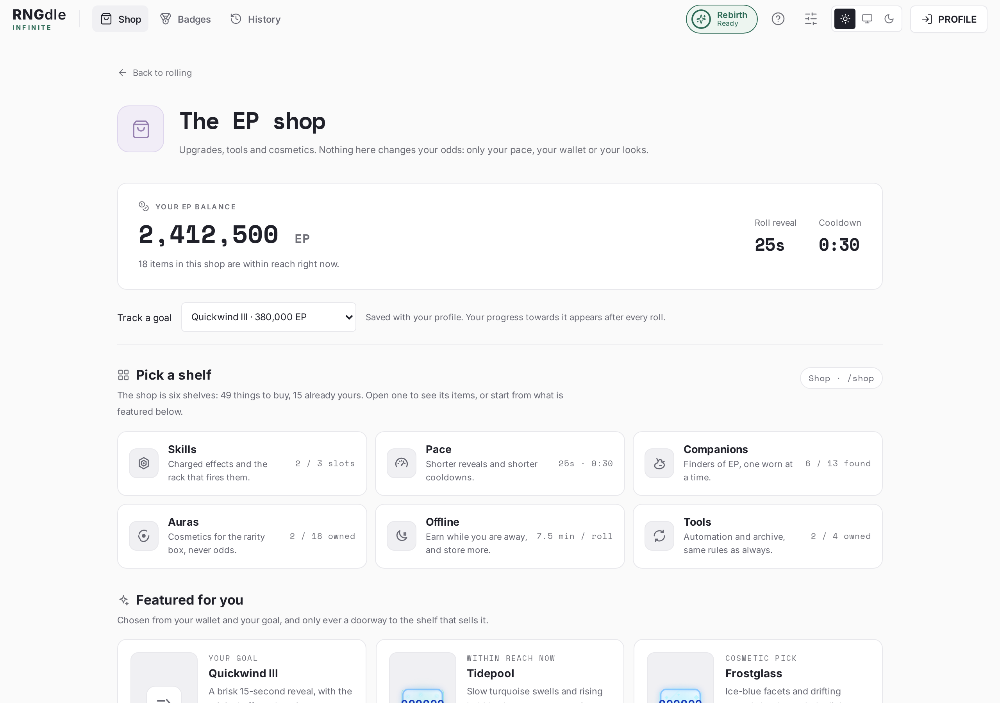
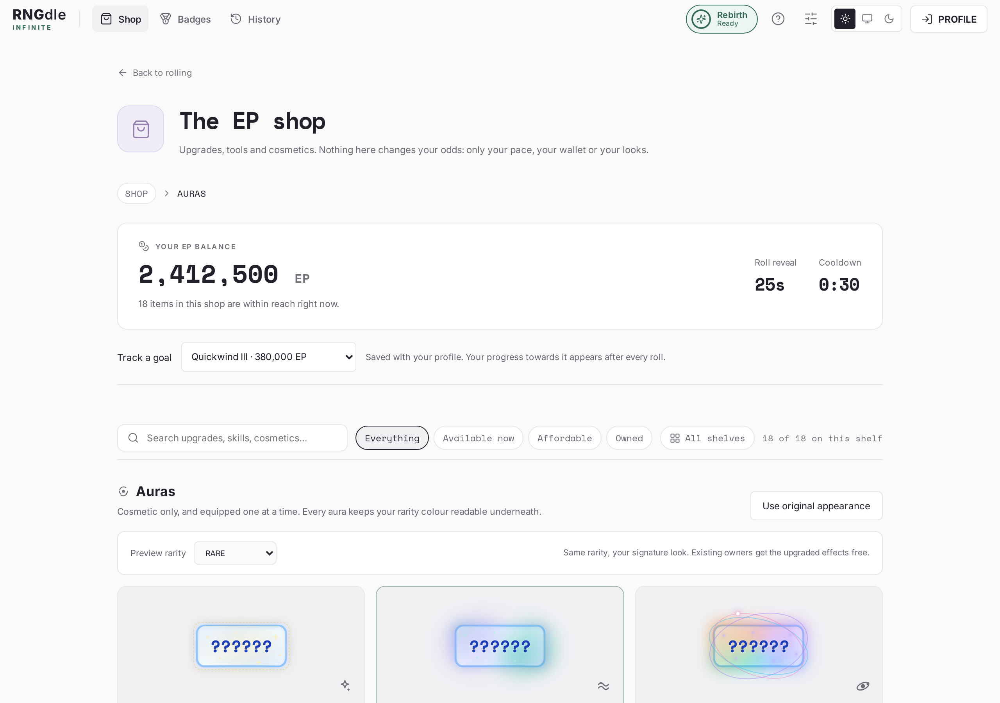
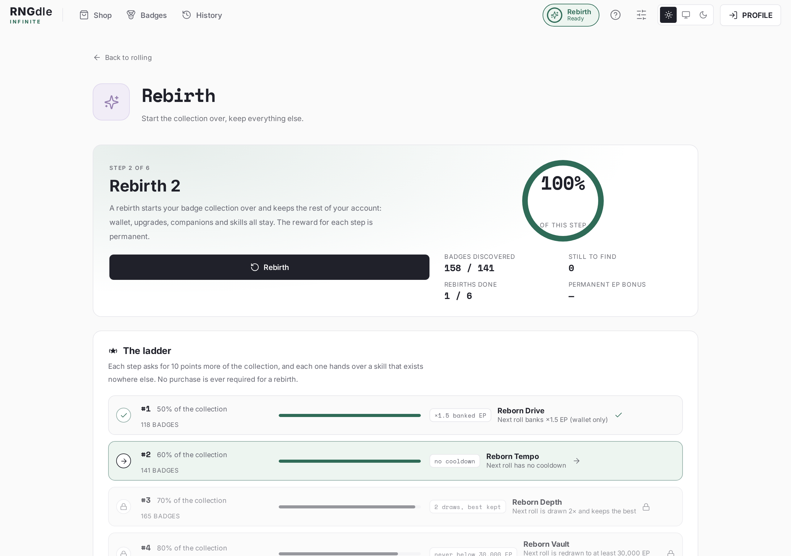
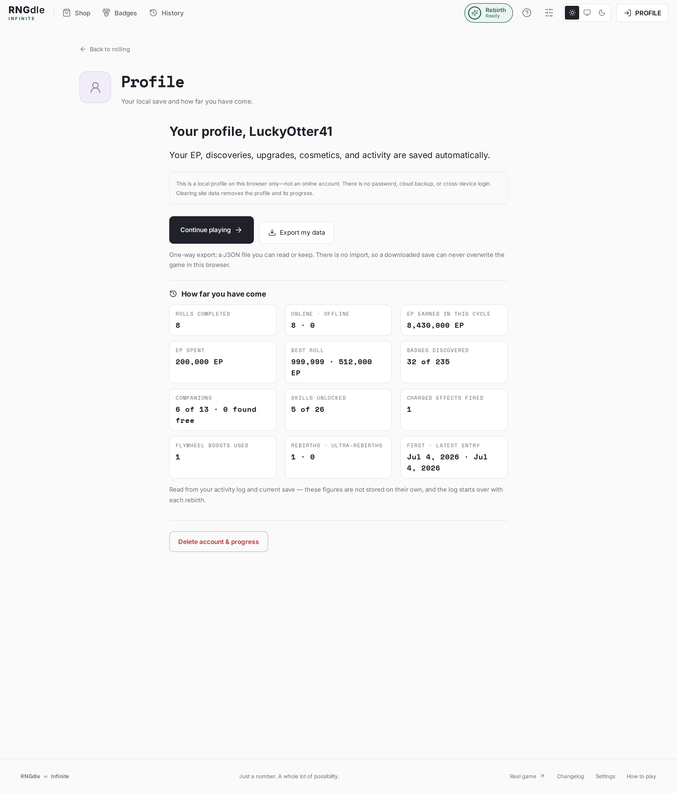

# RNGdle Infinite

**Roll a number from 0 to 1,000,000. Find out what makes it special.**

RNGdle Infinite is a browser game about rolling numbers, scoring EP, discovering
badges, buying upgrades and starting over — with infinite patience, no energy
meters and no daily limit.

**[▶ Play it](https://jaime-gaming.github.io/RNGdle-Infinite/)** — free, no
account, works on desktop and mobile.



## Table of contents

- [How a roll works](#how-a-roll-works)
- [What makes a number special](#what-makes-a-number-special)
- [Companions](#companions)
- [Skills and the rack](#skills-and-the-rack)
- [Flywheel](#flywheel)
- [The shop](#the-shop)
- [Rebirth and ultra-rebirth](#rebirth-and-ultra-rebirth)
- [Your profile, your data](#your-profile-your-data)
- [Fairness](#fairness)
- [Saving, privacy and guests](#saving-privacy-and-guests)
- [Settings, themes and accessibility](#settings-themes-and-accessibility)
- [Questions people actually ask](#questions-people-actually-ask)
- [Credits](#credits)
- [Running it locally](#running-it-locally)

## How a roll works

Three steps, over and over:

1. **Roll.** Press **GENERATE**. The game draws a uniformly random whole number
   between 0 and 1,000,000 — every value equally likely, including the number
   you just rolled.
2. **Score.** The number is revealed digit by digit, then its EP value, its
   rarity tier and its rank against the whole population. Every badge the number
   earns is listed with how much EP it added.
3. **Wait.** A reveal and a cooldown keep the rhythm honest. The base cycle is a
   45-second reveal plus a 60-second cooldown, and both can be bought down to a
   10-second reveal and a 2-second cooldown. Both are snapshotted when you press
   the button, so buying something mid-roll never shortens the roll in flight.

Your EP is a real wallet. Roll, earn, spend it on upgrades and cosmetics, roll
faster.



## What makes a number special

A number earns **badges** for its digit patterns: pairs, triples, runs, mirrored
digits, repeating blocks, lucky sevens, round numbers and the two **Infinite
Originals** that exist only here (Pendulum and Last Second). Each badge is worth
EP, and only the best badge in a family counts towards the total, so 777777 pays
once rather than five times.

There are **235 badges across 18 sets**, split into six rarities from Common to
Mythic, plus the **GODLY** tier for the very top scores. The collection is
discovery-only: you see a badge only once you have earned it, and each new one
is a permanent mark on your collection page. Nothing is ever taken away except
by a rebirth, which is a decision you make on purpose.

| What you see | What it means                                                              |
| ------------ | -------------------------------------------------------------------------- |
| **Number**   | The exact number drawn this roll. It is never editable.                    |
| **Tier**     | Trash, Common, Uncommon, Rare, Epic, Anomaly, Mythic or GODLY.             |
| **Rank**     | Where this number sits in the full population of 1,000,001, ties included. |
| **EP**       | The score, added to your wallet exactly once.                              |
| **Badges**   | Everything the number earned, lowest to highest, with each EP bonus.       |

## Companions

There are **13 companions**, from Pebble at **+5%** to Ember Dragonet at
**+80%**, priced from 45,000 EP to 20,000,000 EP. You can buy one in the shop,
or find one free at roughly **1 in 250 rolls** — a lucky roll drops a random
companion you do not own yet, and it is worn automatically if you do not already
wear one.

Only **one companion is equipped at a time** — and the equipped one is the one
on the roll screen, not just in a list: it walks the stage while you roll, with
its sign and its bonus right there, and it moves a little quicker while a number
is revealing. A companion found on a roll walks in with its own entrance before
it joins the parade. The rest wait on the shelf. The layer is decorative and
inert, and reduced motion replaces the walk with a still row.

What a companion does is deliberately narrow: it multiplies **the EP that lands
in your wallet**. The number you rolled, its tier, its badges, its score and its
rank are untouched. Two players rolling the same number always score the same;
a companion just means you reach the next upgrade sooner.

Companions can be swapped for free at any time, and each one carries an
exclusive skill.

## Skills and the rack

Skills are charged, one-shot effects. The rack sits in the **top-left corner of
the Roll page** — every slot is an icon inside a ring, and the ring fills as you
complete online rolls. When it is full the skill is _armed_, and **the next roll
fires it**. Hover, focus or use a screen reader to read the name, the exact
effect and the charge state.

Two things in that corner keep the arithmetic out of your head: an armed circle
shows **what it adds** ("×2 banked EP", "2 draws, best kept"), and the **Σ
button** opens the total — every equipped skill with its charge, the banked-EP
multiplier with each part named (companion, ultra-rebirth bonus, wallet skills),
the draw plan for the next roll, and whether it is cooldown-free. The same
figures appear in the shop's Skills shelf, so both places always agree.


Seven skills are bought in the shop, thirteen belong to companions (each
companion teaches one skill that exists nowhere else and only works while that
companion is worn), and six are handed out by the rebirth ladder — one per rung.

| Skill             |        Price | Charges | Effect                                                  |
| ----------------- | -----------: | ------: | ------------------------------------------------------- |
| **Surge**         |   180,000 EP |       6 | The next roll banks double EP                           |
| **Trail**         |   320,000 EP |       6 | The next roll finds companions four times as often      |
| **Bounce**        |   500,000 EP |       5 | The next roll has no cooldown (the reveal still plays)  |
| **Double Vision** |   900,000 EP |      10 | Draws two numbers and keeps the one that scores more EP |
| **Bedrock**       | 1,600,000 EP |       8 | Redraws to at least 25,000 EP, at most four draws       |
| **Turbo**         | 2,600,000 EP |      10 | The next roll counts three times towards charging       |
| **Big Game**      | 6,000,000 EP |      18 | Redraws to at least 100,000 EP, at most five draws      |

Every effect stays inside the honest-roll rule: **a skill may touch the roll,
but never the scoring table.** Wallet multipliers only multiply banked EP, and
draw skills compare the already-verified scores of numbers actually drawn and
are capped at eight draws. When a skill fires, the effect is written into the
committed roll, so a reload, a second tab or a retry can never re-fire it or
re-roll for something better.

The rack starts with **two slots**. Skill Bay I (**1,000,000 EP**) widens it to
three, Skill Bay II (**4,000,000 EP**) to four. Equipping, unequipping and
swapping skills is **free** — the bays are the purchase, the loadout is not.

## Flywheel

Flywheel is the pace skill, and it lives in the same rack as a cog ring, so one
glance covers every charged effect on your account.

- **Flywheel — 450,000 EP:** four completed online rolls charge it, and the
  fifth roll keeps its full reveal but has **zero cooldown**.
- **Flywheel II — 1,500,000 EP:** two charging rolls, then a boosted third.
- **Flywheel III — 3,600,000 EP:** one charging roll, so every other roll is
  boosted.

Boosted rolls do not charge the next cycle, and offline rolls neither charge nor
consume it. A full five-roll cycle averages 93 seconds per roll at the fastest
pace before Flywheel — and with everything maxed, the average cycle is about
**11 seconds per roll**.

## The shop

`/shop` is the shop's front door: **six buttons**, one per shelf — Skills, Pace,
Companions, Auras, Offline and Tools. Each button names what the shelf is for and
carries the one number that matters on it (slots used, current reveal and
cooldown, companions found, auras owned, the EP-per-roll rate, tools owned), and
each one **opens the shelf as its own page**: `/shop/skills`, `/shop/auras` and
so on, with its own address to bookmark or share.

Above the shelves sit three **featured picks**, chosen from your tracked goal and
your wallet — your goal, something within reach, a cosmetic — and each one is
only a doorway to the shelf that sells it, with a meter against its price. A
shelf keeps its own **sticky bar**: search, the same filters and a button back to
all shelves. Filters only narrow what is drawn (`19 of 49 on this shelf`), and a
description is held to three lines so a shelf reads as a list, not a wall of
text. The old `#shop` bookmark still works, and `#auras` lands on that shelf.




| Shelf          | What it sells                                                                      |
| -------------- | ---------------------------------------------------------------------------------- |
| **Skills**     | Seven charged effects, the two skill bays, and the Flywheel tiers                  |
| **Pace**       | Quickwind (shorter reveals) and Clockwork (shorter cooldowns), one level at a time |
| **Companions** | Thirteen companions from 45,000 EP, or free if a roll drops one                    |
| **Auras**      | Eighteen cosmetic looks for your number box, equipped one at a time                |
| **Offline**    | The Offline Roller plus clocks and vaults: rolls earned while away                 |
| **Tools**      | Auto-Roll, Persistence Core and the Archive Lens history search                    |

**Auto-Roll is an ability**, not a settings switch: once bought it appears in
the corner rack as its own circle. One click arms it, another click stands it
down, and the ring and its label state whether it is running, paused or off. It
never skips a reveal, a cooldown or a draw, and without Persistence Core it
starts off again after a reload.

Every purchase is confirmed, costs EP once, and never changes odds or scores.
The whole catalogue comes to 96.35 M EP, and no upgrade costs more than four
times its own prerequisite.

## Rebirth and ultra-rebirth

Rebirth is a **ladder**, not a single wall, and it is driven by the badge
collection alone — never by shop ownership.

| Rung | Required | Badges | Granted skill  |
| ---: | -------: | -----: | -------------- |
|    1 |      50% |    118 | Reborn Drive   |
|    2 |      60% |    141 | Reborn Tempo   |
|    3 |      70% |    165 | Reborn Depth   |
|    4 |      80% |    188 | Reborn Vault   |
|    5 |      90% |    212 | Reborn Omen    |
|    6 |     100% |    235 | Reborn Paragon |

Rebirth says **nothing at all before it unlocks**: no header entry, no counter,
no teaser, and a direct link to `/rebirth` simply goes home. From **30% (71
badges)** the ring appears in the header and fills towards the rung you are on,
turning green and reading _Ready_ when it is met. The rebirth page then lays the
whole thing out: the six rungs with the badges each one asks for and the skill
it grants, the figures for the current step, what a rebirth keeps, what it
resets, and the permanent ultra-rebirth bonus with its own explanation. Each
rebirth:

- **keeps** your EP, every upgrade, your companions, your skills and your
  profile, and
- **resets** the badge collection to zero (so the next rung's percentage is
  rediscovered from scratch), the equipped aura, and the activity history.



Finish the sixth rung and **ultra-rebirth** unlocks: a genuine full reset — EP,
badges, purchases, companions, skills and the rebirth counter — in exchange for
a **permanent, stackable +10% to banked EP** for every ultra-rebirth, and a
cosmetic mark next to your profile. Both resets require typing the word
(`REBIRTH` or `ULTRA`) and cannot be undone.

## Your profile, your data

Signing up is just a local name for a save file in your browser — no email, no
password, no server. Your profile page shows **how far you have come**, all of
it derived live from your save and your activity log rather than stored twice:
rolls completed, online vs offline, EP earned in this cycle, EP spent, your best
roll, badges discovered, companions found free, skills unlocked, charged effects
fired, Flywheel boosts used, rebirths and ultra-rebirths, and the date of your
first and latest entry.



**Export my data** downloads a JSON snapshot of the whole save — profile,
figures and full activity history — so you can read it, archive it or keep it
somewhere safe. It is deliberately **one-way**: there is no import anywhere, so
a downloaded file can never overwrite the game you are playing. Delete account &
progress remains the only way to remove it.

## Fairness

- **Uniform randomness.** Every number from 0 to 1,000,000 is equally likely,
  drawn with the browser's cryptographic RNG and rejection sampling. There is no
  number editor, no preset picker, no seed setting and no pity counter.
- **Honest scoring.** The EP value, badges and tier of a number are fixed by the
  rules, and ranks are computed against the complete population of 1,000,001
  numbers with ties included. Nothing a player owns changes what a number is
  worth.
- **Bonuses stay in the wallet.** Companions, wallet skills and ultra-rebirth
  bonuses multiply only the EP that lands in your wallet. Scored EP, tier and
  rank are identical for everyone.
- **No pay-to-win, no real money.** Everything costs in-game EP only.
- **One-shot effects stay one-shot.** A charged skill is snapshotted into the
  committed roll, so nothing can be re-fired, re-rolled or double-credited.

RNGdle Infinite is a frontend-only game: saves live in your browser, which means
a determined person can edit them, exactly as with any offline game. The
architecture is built to make accidental loss — not cheating — the real
difficulty: atomic saves, single-credit receipts, cross-tab locks and
failed-write recovery.

## Saving, privacy and guests

- **Guests can play everything**, but guest progress is not saved and clears on
  reload. Registration starts a clean, genuinely saved account.
- **A local profile** saves your wallet, discoveries, upgrades, aura, companions,
  skills, cooldowns and activity log in `localStorage` on this browser and
  origin only. There is no cloud backup and no cross-device sync.
- **Multi-tab safe.** Tabs share one save through storage events and Web Locks:
  simultaneous rolls join the same draw, purchases cannot overspend, and a
  second rebirth cannot apply twice.
- **Nothing is sent anywhere.** No analytics, no accounts, no backend, no
  runtime CDN. The only network requests are the game's own asset files.

## Settings, themes and accessibility

Settings are presentation only — nothing there changes odds, EP, prices or
timings. You can turn desktop notifications and the ready chime on, force
reduced motion, hide the skill bar, hide the goal recap, use compact EP numbers,
skip purchase confirmations, or make the Auto-Roll ability start armed.

Light, dark and system themes are all real palettes with contrast-checked
colours. Reduced motion completes a reveal instantly while still reserving the
full committed deadline, so accessibility never becomes a shortcut. The whole
game is keyboard reachable, dialogs trap focus, and every result is announced to
screen readers.

## Questions people actually ask

**Is there a roll limit?** No. Roll as often as you like, as long as the reveal
and cooldown have finished. No energy, no waiting rooms, no paywall.

**Can I get a specific number on purpose?** No. There is no seed, editor or
preset, and none is planned.

**Does a companion make my rolls luckier?** No — it multiplies banked EP only.
Trail and Drift are the exception by design: they raise the chance of finding a
companion, and they use their own random sample rather than the roll's.

**Do offline rolls count towards skills and Flywheel?** No. Offline rolls pay
their EP and count in your history, but charging is online-only.

**What happens to my purchases when I rebirth?** They stay. Only the badge
collection, the aura, the activity history and the cycle's own bookkeeping are
cleared. An ultra-rebirth is the one that hands everything back.

**Is this the official RNGdle?** No. It is an independent recreation, built from
public rules and reference data. See credits below.

## Credits

- [RNGdle](https://www.rngdle.com/), created by Cam / sparrowpatch. RNGdle
  Infinite is an independent frontend recreation and is not the official
  service.
- [RNGdle Tools](https://rng.cubityfir.st/) and its [badge
  catalogue](https://rng.cubityfir.st/badges), [Luck
  page](https://rng.cubityfir.st/luck) and [documented roll
  timings](https://github.com/CubityFirst/rngdle-ep-calculator) — the pinned
  full-range indexes the scoring and ranks are derived from.
- [Box Lab](https://rng.cubityfir.st/beta/boxes) for the scoring-box palette
  reference.
- Badge artwork: [Twemoji](https://github.com/jdecked/twemoji), Twitter, Inc.
  and other contributors, [CC BY 4.0](https://creativecommons.org/licenses/by/4.0/).
- Fonts: Inter and Space Mono via Fontsource, SIL Open Font License.
- Interface icons: [Lucide](https://lucide.dev/), ISC license, plus the
  original marks and companion artwork drawn for this project (one 24×24 grid,
  one stroke weight) in `src/components/game-icons.jsx`.

## Running it locally

For anyone who wants to tinker:

```sh
npm install
npm run dev             # http://localhost:5173
npm test                # Playwright suite (needs a Chromium binary)
npm run audit:economy   # reproducible price and roll-distribution audit
npm run build           # production build
npm run pages:publish   # rebuild docs/, which is what GitHub Pages serves
```

The screenshots in this README are generated from the running game rather than
made by hand:

```sh
npm run dev
CHROMIUM_PATH=/path/to/chrome npm run screenshots   # writes media/
npm run vendor:emoji                                # check local emoji artwork
```

To use an existing Chromium binary instead of downloading one, set
`CHROMIUM_PATH`. The publishing flow, data preparation and the deeper
implementation notes live in `src/data/README.md` and the code itself.
