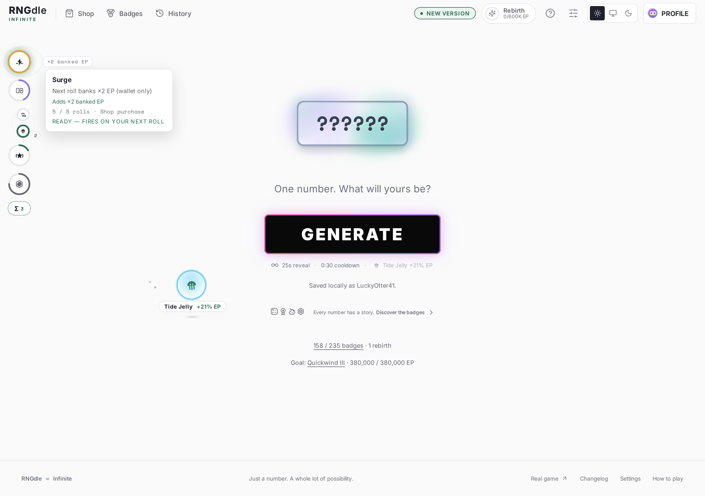
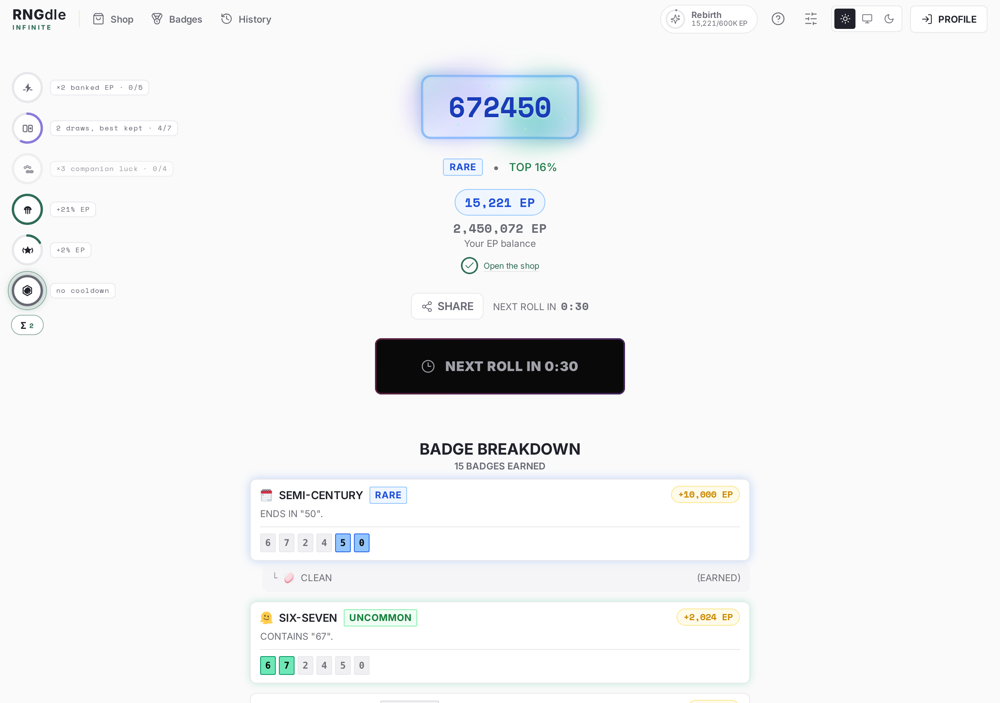
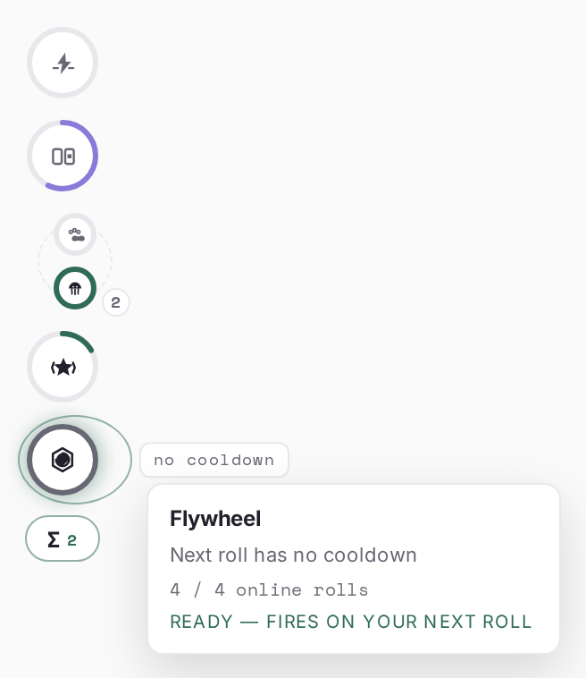
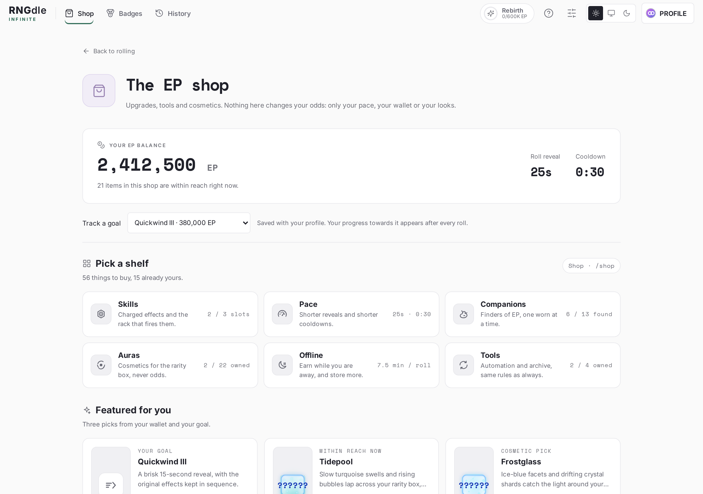
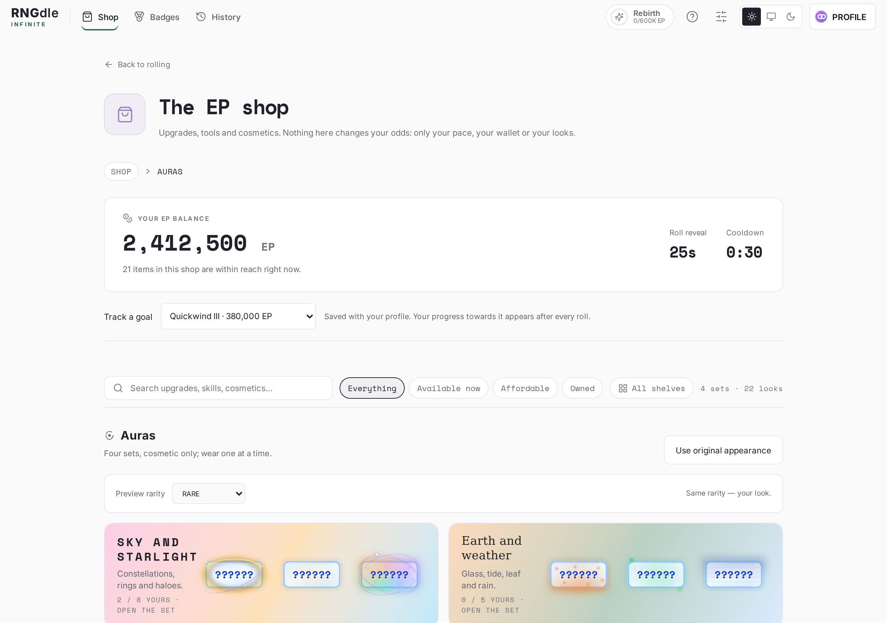
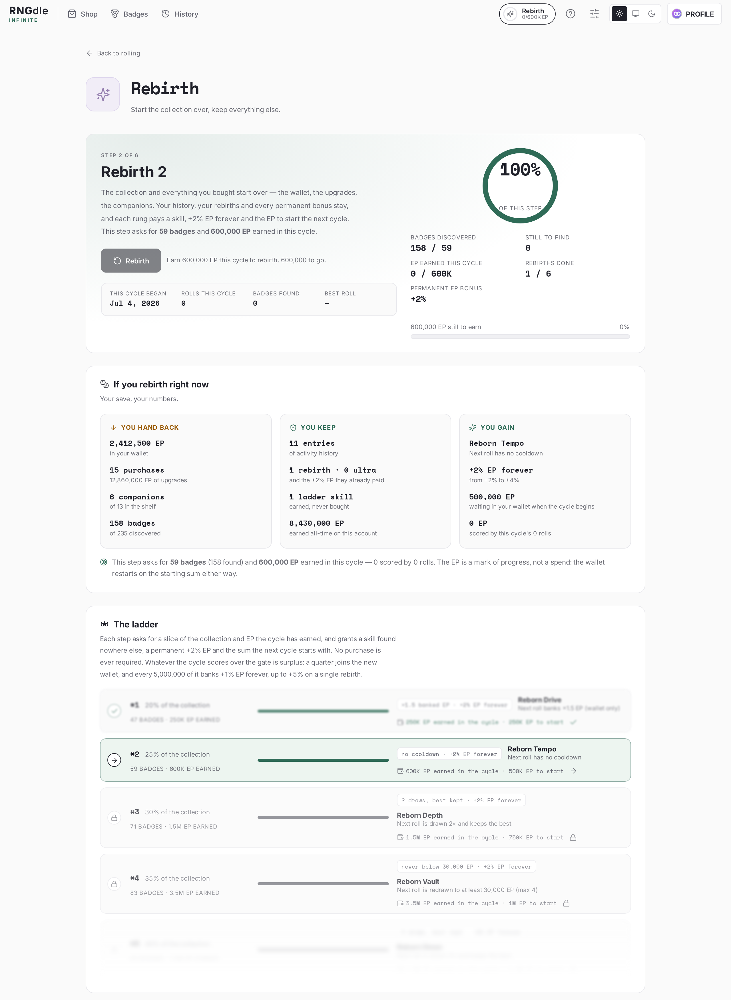
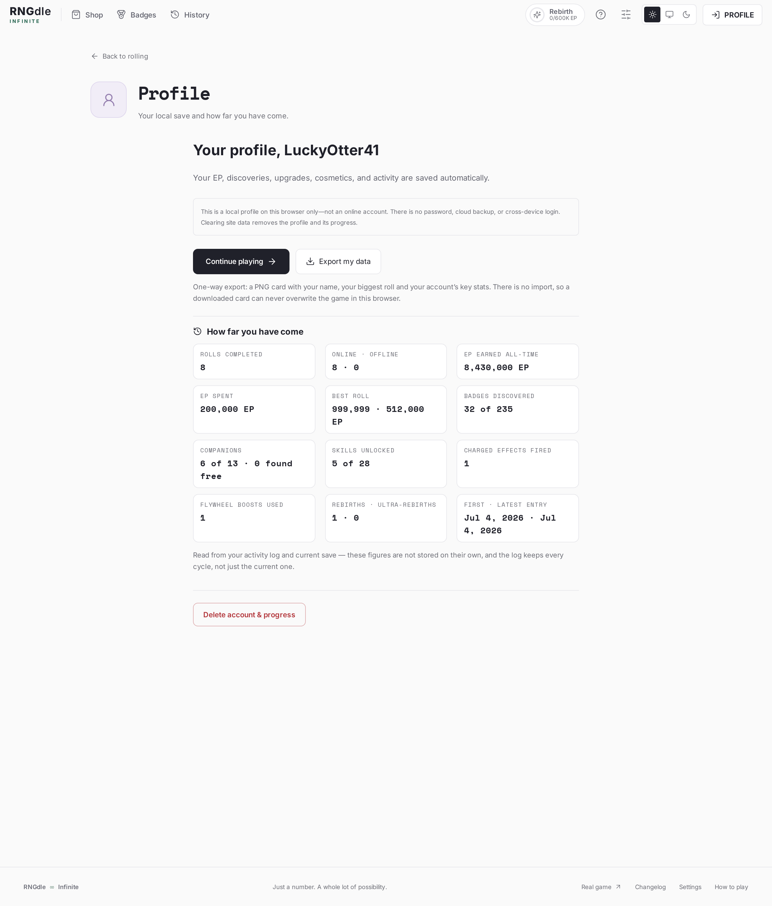
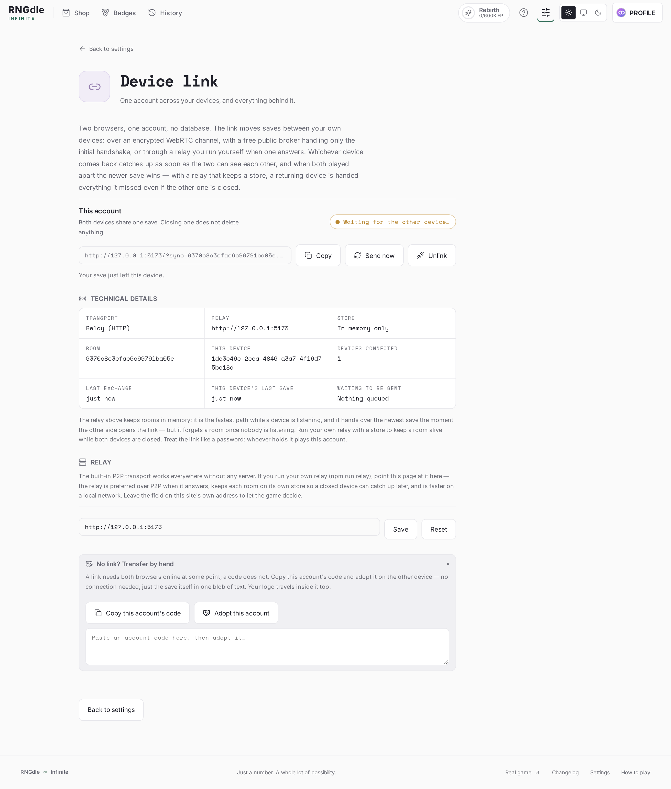

# RNGdle Infinite

**Roll a number from 0 to 1,000,000. Find out what makes it special.**

RNGdle Infinite is a browser game about rolling numbers, scoring EP, discovering
badges, buying upgrades and starting over — with infinite patience, no energy
meters and no daily limit.

**[▶ Play it](https://jaime-gaming.github.io/RNGdle-Infinite/)** — free, no
account, works on desktop and mobile.



## Table of contents

- [How a roll works](#how-a-roll-works)
- [What makes a number special](#what-makes-a-number-special)
- [Companions](#companions)
- [Skills and the rack](#skills-and-the-rack)
- [Flywheel](#flywheel)
- [Tasks](#tasks)
- [The shop](#the-shop)
- [Rebirth, prestige and Rollback](#rebirth-prestige-and-rollback)
- [Your profile, your data](#your-profile-your-data)
- [Fairness](#fairness)
- [Saving, privacy and guests](#saving-privacy-and-guests)
- [Settings, themes and accessibility](#settings-themes-and-accessibility)
- [Questions people actually ask](#questions-people-actually-ask)
- [Credits](#credits)
- [Running it locally](#running-it-locally)

## How a roll works

Three steps, over and over:

1. **Roll.** Press **GENERATE**. The game draws a uniformly random whole number
   between 0 and 1,000,000 — every value equally likely, including the number
   you just rolled.
2. **Score.** The number is revealed digit by digit, then its EP value, its
   rarity tier and its rank against the whole population. Every badge the number
   earns is listed with how much EP it added.
3. **Wait.** A reveal and a cooldown keep the rhythm honest. The base cycle is a
   45-second reveal plus a 60-second cooldown, and upgrades can reduce these to a
   10-second reveal and a 2-second cooldown. Both are snapshotted when you press
   the button, so buying something mid-roll never shortens the roll in flight.
   The countdown names the wait it is actually showing: **COOLDOWN IN** while the
   reveal still holds the roll back, **NEXT ROLL IN** once the cooldown itself is
   ticking, and **REVEAL IN** when a boost or a waive skill removed the cooldown
   entirely.

Your EP is a real wallet. Roll, earn, spend it on upgrades and cosmetics, roll
faster.



## What makes a number special

A number earns **badges** for its digit patterns: pairs, triples, runs, mirrored
digits, repeating blocks, lucky sevens, round numbers and the two **Infinite
Originals** that exist only here (Pendulum and Last Second). Each badge is worth
EP, and only the best badge in a family counts towards the total, so 777777 pays
once rather than five times.

There are **235 badges across 18 sets**, split into six rarities from Common to
Mythic, plus the **GODLY** tier for the very top scores. The collection is
discovery-only: you see a badge only once you have earned it, and each new one
is a permanent mark on your collection page. A rebirth restarts the collection
and the run around it — and only because you decided it should.

| What you see | What it means                                                              |
| ------------ | -------------------------------------------------------------------------- |
| **Number**   | The exact number drawn this roll. It is never editable.                    |
| **Tier**     | Trash, Common, Uncommon, Rare, Epic, Anomaly, Mythic or GODLY.             |
| **Rank**     | Where this number sits in the full population of 1,000,001, ties included. |
| **EP**       | The score, added to your wallet exactly once.                              |
| **Badges**   | Everything the number earned, lowest to highest, with each EP bonus.       |

## Companions

There are **13 companions**, from Pebble at **+5%** to Ember Dragonet at
**+80%**, priced from 25,000 EP to 10,000,000 EP. You can buy one in the shop,
or find one free at roughly **1 in 250 rolls** — a lucky roll drops a random
companion you do not own yet, and it is worn automatically if you do not already
wear one.

The companion shelf is a **slideshow of cages**: one companion stands in the
middle of the stage and the arrows on either side slide to the next one, with a
rail of small cages underneath to jump straight to any friend. Each cage is
tinted with that companion's own colour, and the stage shows its bonus, its
description and its signature skill before you decide.

Only **one companion is equipped at a time** — and the equipped one is the one
on the roll screen, not just in a list: it walks the stage while you roll, with
its sign and its bonus right there, and it moves a little quicker while a number
is revealing. A companion found on a roll walks in with its own entrance before
it joins the parade. The rest wait on the shelf. The layer is decorative and
inert, and reduced motion replaces the walk with a still row.

What a companion does is deliberately narrow: it multiplies **the EP that lands
in your wallet**. The number you rolled, its tier, its badges, its score and its
rank are untouched. Two players rolling the same number always score the same;
a companion just means you reach the next upgrade sooner.

Companions can be swapped for free at any time, and each one carries an
exclusive skill. When that skill fires on a roll, the companion steps off the
stage for the duration of the roll and appears as a small mark on the corner of
your number; once the roll settles, the mark is gone and the walk continues.

## Skills and the rack

Skills are charged, one-shot effects. The rack sits in the **top-left corner of
the Roll page** — every slot is an icon inside a ring, and the ring fills as you
complete online rolls. When it is full the skill is _armed_, and **the next roll
fires it**. Hover, focus or use a screen reader to read the name, the exact
effect and the charge state.

Two things in that corner keep the arithmetic out of your head: related circles
ride together in **stacks** — the pet bonus with its signature skill, the
rebirth bonuses with their ladder skills. A stack is one circle, not a crowd:
the family's icon sits in the middle, and every member owns an **equal slice of
that one circumference**, with a small gap between slices. The circle is the
same size as a single skill's, with thicker lines, so the two read as one row. Each slice keeps its
skill's own colour and fills as that skill charges, so counting the slices
counts the family. Hover, focus or tap fans it out into the
ordinary circles while shop skills stand alone, and every circle only shows
**what it adds**
("×2 banked EP", "+5% EP", "2 draws, best kept") while hovered or focused. The
**Σ button** opens the total — every equipped and companion skill with its
charge, the banked-EP
multiplier with each part named (companion, rebirth, prestige, Rollback, surplus and
wallet skills), the draw plan for the next roll, and whether it is
cooldown-free. That panel is the only place the total is written out, so it is
never contradicted.

And when the roll itself applies the money, each bonus charge floats into
`Your EP balance` as a staggered animation. A plain roll states only the base
gain.



Nine skills are bought in the shop — but the shelf is a **stall**: only **three
are on sale at a time**, and the trio rotates every **five minutes** like a
shop's stock. A timer on the shelf says when it refreshes, and the skills that
are out of the rotation stay listed, dimmed under a **green restock aura** with
the countdown on the button. Thirteen belong to companions (each companion teaches one
skill that exists nowhere else and only works while that companion is worn),
and six are handed out by the rebirth ladder — one per rung. Both earned kinds
are equipped from the Skills shelf, like shop skills.

| Skill             |         Price | Charges | Effect                                                   |
| ----------------- | ------------: | ------: | -------------------------------------------------------- |
| **Surge**         |    180,000 EP |       5 | The next roll banks double EP                            |
| **Trail**         |    160,000 EP |       5 | The next roll finds companions four times as often       |
| **Bounce**        |    500,000 EP |       4 | The next roll has no cooldown (the reveal still plays)   |
| **Double Vision** |    900,000 EP |       7 | Draws two numbers and keeps the one that scores more EP  |
| **Bedrock**       |  1,600,000 EP |       6 | Redraws to at least 25,000 EP, at most four draws        |
| **Turbo**         |  2,600,000 EP |       7 | The next roll counts three times towards charging        |
| **Big Game**      |  6,000,000 EP |      11 | Redraws to at least 100,000 EP, at most five draws       |
| **Miser**         |  9,000,000 EP |       7 | The next roll banks triple EP                            |
| **Triptych**      | 12,000,000 EP |       6 | Draws three numbers and keeps the one that scores top EP |

Every effect stays inside the honest-roll rule: **a skill may touch the roll,
but never the scoring table.** Wallet multipliers only multiply banked EP, and
draw skills compare the already-verified scores of numbers actually drawn and
are capped at eight draws. Draw skills **stack**, and stacking pays twice over:
their budgets add up, so Double Vision's two draws and Bedrock's four spend six,
and **each skill keeps a number of its own** — Double Vision keeps the best of
its two, Bedrock the best of its four, and the roll banks both. A floor is a
promise rather than a quantity, so the strongest one is the one that holds, and
the skills together still stop at the eight draws a roll may spend. A live roll with a draw skill also makes one ordinary draw of its own, after theirs: a plain number that can win like any other, while the numbers the skills kept stay paid either way. When a skill
fires, the effect is written into the committed roll, so a reload, a second tab
or a retry can never re-fire it or re-roll for something better.

A draw skill does its work where you can watch it. The screen becomes **one
panel per draw**, divided by visible lines, and every draw rolls its digits and
earns its badges there **at the same time**, each with the EP it would have
banked. Nothing behind the screen is visible or scrolls. Once the last badge has
landed, the draw that scored the most EP is **filled green** and marked **Best**,
and **every number stays on the screen**: nothing flies to the centre and nothing
is greyed out. Tap a number and it opens at full size, with its own rank, EP and
badges and the roll's button in the middle; the best one opens as the roll's own
result, and a paid one also shows your EP balance and shares its own result. The
roll's button sits where the panels meet when that spot covers no number, label or hint, and centred under the numbers otherwise. **All numbers** brings the screen back. Auto-Roll keeps turning while the
screen is open, and stands still only while a single number is open. Each panel
that a skill claimed says so, in that skill's colour, and a stacked roll lists
every number being paid. The
best number is the one ranked and shown as the roll; the others are banked beside
it, because the draws behind them were really rolled. The activity feed keeps the
receipt — _best of 3 draws_ — next to each number that was kept.

The rack starts with **two slots**, for **shop skills only**. Rebirth rewards
and companion signatures **ride free** beside the rack: equip every one you
have earned and the slots stay open. Skill Bay I (**1,000,000 EP**) widens it
to three, Skill Bay II (**4,000,000 EP**) to four. Equipping, unequipping and
swapping skills is **free** — the bays are the purchase, the loadout is not.
The Skills shelf also keeps **four saved racks**: save the set you have equipped
and put the whole rack back with one click. They belong to the run, so a rebirth
clears them along with the skills that paid for them.

## Flywheel

Flywheel is the pace skill, and it lives in the same rack as a cog ring, so one
glance covers every charged effect on your account.

- **Flywheel — 450,000 EP:** four completed online rolls charge it, and the
  fifth roll keeps its full reveal but has **zero cooldown**.
- **Flywheel II — 1,500,000 EP:** two charging rolls, then a boosted third.
- **Flywheel III — 3,600,000 EP:** one charging roll, so every other roll is
  boosted.

Boosted rolls do not charge the next cycle, and offline rolls neither charge nor
consume it. A full five-roll cycle averages 93 seconds per roll at the fastest
pace before Flywheel — and with everything maxed, the average cycle is about
**11 seconds per roll**.

## Tasks

Tasks are small goals that pay EP. **Daily** tasks reset at local midnight and
**weekly** ones on Monday. Each cadence has a pool of twelve tasks, and every
period four of them go on your list. The four come from the period and the task
itself, so everyone gets the same four on the same day or week. Each pays once
per reset, when you claim it on the **Tasks** page, one at a time or with
**Claim all**. A dot on the Tasks tab says when one is ready, and a notice says
what just became ready.

Finishing every task on a list also pays its **list bonus**: 100,000 EP for the
daily list and 500,000 EP for the weekly one. It is paid in the same step as the
last claim, once per reset, and it is logged as a task.

Some tasks read your best roll rather than a running total. **Land a roll worth
…** and **Earn N badges on one roll** count the best single roll of the period,
so a bigger roll replaces a smaller one instead of adding to it. A task swapped
in later by a Task Skip can therefore already be met by a roll earlier that
period.

| Cadence | Task                         |     Reward |
| ------- | ---------------------------- | ---------: |
| Daily   | Roll 10 numbers              |  20,000 EP |
| Daily   | Roll a Rare or better        |  25,000 EP |
| Daily   | Roll an Epic or better       |  50,000 EP |
| Daily   | Roll a Mythic or GODLY       | 150,000 EP |
| Daily   | Discover 3 new badges        |  25,000 EP |
| Daily   | Earn 22 badges on one roll   |  80,000 EP |
| Daily   | Bank 50,000 EP from rolls    |  20,000 EP |
| Daily   | Bank 250,000 EP from rolls   |  60,000 EP |
| Daily   | Land a roll worth 200,000 EP | 100,000 EP |
| Daily   | Land a multi-number roll     |  50,000 EP |
| Daily   | Fire a skill once            |  15,000 EP |
| Daily   | Find a companion             | 100,000 EP |
| Weekly  | Roll 100 numbers             | 200,000 EP |
| Weekly  | Roll 5 Rare or better        | 150,000 EP |
| Weekly  | Roll 2 Epic or better        | 300,000 EP |
| Weekly  | Roll 10 Mythic or GODLY      | 900,000 EP |
| Weekly  | Discover 15 new badges       | 200,000 EP |
| Weekly  | Bank 1,000,000 EP from rolls | 200,000 EP |
| Weekly  | Bank 5,000,000 EP from rolls | 600,000 EP |
| Weekly  | Land a roll worth 500,000 EP | 500,000 EP |
| Weekly  | Land 3 multi-number rolls    | 250,000 EP |
| Weekly  | Fire a skill on 10 rolls     | 300,000 EP |
| Weekly  | Find 2 companions            | 500,000 EP |
| Weekly  | Earn 25 badges on one roll   | 600,000 EP |

Only online rolls count: an offline roll is a reward for being away, not for
play. _Discover_ counts badges you have not found yet in the current cycle, so
once the collection is complete that task waits for a rebirth. _Find a
companion_ counts the companion a roll drops, about one roll in 250. Progress
lives on the save, not in the activity log, so clearing history never un-finishes
a task. A reward goes into your wallet and is logged as income. Unclaimed rewards
expire when their reset comes, and task EP never counts towards a rebirth's
cycle gate.

**Task Skip** is a Shop product on the Tools shelf. Using one swaps an open task
on your list, one that is neither claimed nor finished, for the next task in its
pool that is not on the list yet. Each purchase adds one use; you can hold up to
three, you can buy one a day on the game clock, and no more than three in any
five days. Buying one costs 125,000 EP like any purchase. Using it costs nothing
and is not written to the activity log.

`/shop` is the shop's front door: **one button per shelf** — Skills, Pace,
Companions, Auras and Tools, plus **Offline once the Offline Roller is yours**
(the shelf stays out of the shop entirely until it is unlocked). Each button
names what the shelf is for and carries the one number that matters on it
(slots used, current reveal and cooldown, companions found, auras owned, the
EP-per-roll rate, tools owned), and each one **opens the shelf as its own
page**: `/shop/skills`, `/shop/auras` and so on, with its own address to
bookmark or share.

Above the shelves sit three **featured picks**, chosen from your tracked goal and
your wallet — your goal, something within reach, a cosmetic — and each one is
only a doorway to the shelf that sells it, with a meter against its price. The
**savings goal** banner lives in the shop too: what you are tracking (or what
the shop recommends), how the wallet is doing against it, and the shelf that
sells it. Setting one is a deliberate choice: press **Set goal** on the banner,
then **tap any item on any shelf** and that item becomes your goal — no EP is
ever spent on it. A companion you have not found yet can be your goal too: press
**Set as goal** on its card (or tap it in pick mode), and it is the one the
banner, the roll screen and the featured picks point at. A companion goal is
met the moment you find it, by buying or by a lucky drop. A shelf keeps its own
**sticky bar**: a button back to all shelves and the count of what is on it.
Every shelf shows everything it has, and a description is held to three lines
so a shelf reads as a list, not a wall of text. Every shelf reads **from the
cheapest item upwards**, and the Skills shelf adds its own twist: a rotating
stall that only ever stocks three shop skills at a time, with a countdown to
the next trio. The old `#shop` bookmark still works, and `#auras` lands on
that shelf.




| Shelf          | What it sells                                                                                                         |
| -------------- | --------------------------------------------------------------------------------------------------------------------- |
| **Skills**     | Nine charged effects (three on sale at a time, restocked every 5 minutes), the two skill bays, and the Flywheel tiers |
| **Pace**       | Quickwind (shorter reveals) and Clockwork (shorter cooldowns), one level at a time                                    |
| **Companions** | Thirteen companions from 25,000 EP, or free if a roll drops one                                                       |
| **Auras**      | Twenty-six cosmetic looks in five families, each family its own page, equipped one at a time                          |
| **Offline**    | The Offline Roller plus clocks and vaults: rolls earned while away                                                    |
| **Tools**      | Auto-Roll, Persistence Core and the Archive Lens history search                                                       |

The Auras shelf is the one long shelf, so it is split into **five families** —
sky and starlight, earth and weather, made things, deep and dark, and
**R4ND0MN3S5**, four looks that are random by nature: falling binary digits,
static, scrambled digits and a hex dump. `/shop/auras`
is the index: one **banner per family**, each in that family's own gradient and
its own typeface, wearing its three best looks as live previews. A banner is a
door, not a decoration — it opens the set as a page of its own,
`/shop/auras/celestial` — and every look on that page is a card with a **chip of
its two colours** next to its name and a live preview of the box wearing it, so
the page shows what you are buying before you spend anything.

A shelf also never shows a card you cannot act on: an upgrade that waits behind
another purchase stays off the shelf entirely until that purchase is made, so
every card on screen is the next step of its chain.

**Auto-Roll is an ability**, not a settings switch: once bought it appears in
the corner rack as its own circle. One click arms it, another click stands it
down, and the ring and its label state whether it is running, paused or off. It
never skips a reveal, a cooldown or a draw, and without Persistence Core it
starts off again after a reload.

Every purchase is confirmed, costs EP once, and never changes odds or scores.
The 56 products in the catalogue come to 151.12 M EP, and the most expensive of
them costs 18 M. Everything you buy is yours for the rest of the cycle: a
rebirth puts the whole catalogue back on the shelf.

## Rebirth, prestige and Rollback

Rebirth is a **ladder**, not a single wall, and it is driven by the run you are
playing: a slice of the badge collection **and** EP the current cycle has
earned. No shop purchase is ever part of a rung. The percentage on the Rebirth
page and on the top-bar ring is one number for the step in play: the collection
and the cycle's EP, half each, rounded down, so it reads 100% only when both are
done. Until the sixth rung is finished, Prestige does not appear anywhere: the
page shows a faded teaser where it will sit.

| Rung | Required | Badges |   Cycle EP | Granted skill  |
| ---: | -------: | -----: | ---------: | -------------- |
|    1 |      20% |     47 |    250,000 | Reborn Drive   |
|    2 |      25% |     59 |    600,000 | Reborn Tempo   |
|    3 |      30% |     71 |  1,500,000 | Reborn Depth   |
|    4 |      35% |     83 |  3,500,000 | Reborn Vault   |
|    5 |      40% |     94 |  7,500,000 | Reborn Omen    |
|    6 |      45% |    106 | 15,000,000 | Reborn Paragon |

The EP is **a mark of progress, not a spend**: it is never taken from your
wallet, so buying an upgrade can never lock you out of a rung — the wallet
empties on rebirth either way. It counts the EP this cycle's rolls scored, so
every cycle pays its own way — and the gate is a **floor, not a ceiling**:
whatever the cycle scores _over_ the gate is **surplus**. A quarter of the
surplus joins the new wallet as starting EP (a 100,000 gate taken with
1,000,000 in the cycle carries +225,000 EP into the next run), and every full
5,000,000 of overshoot banks a permanent **+1% to banked EP**, capped at +5%
on any single rebirth. Overshooting is rewarded, never wasted.

Rebirth says **nothing at all before it unlocks**: no header entry, no counter,
no teaser, and a direct link to `/rebirth` simply goes home. From **15% (36
badges)** the ring appears in the header and fills towards whichever half of
the rung is furthest from done — badges or EP — turning green and reading
_Ready_ when both are met. The rebirth page then lays the whole thing out: the
six rungs with the badges and EP each one asks for and the rewards it grants,
the figures for the current step, what a rebirth keeps, what it resets, and the
permanent bonuses with their own explanation. Each rebirth:

- **grants** the rung's skill plus a **permanent, stackable +2% to banked
  EP** (up to +12% with the ladder complete),
- **pays a new cycle**: **250,000 EP for every rung you have climbed** waits in
  your wallet when the next one starts (250,000 after the first, 1,500,000 after
  the sixth), so a fresh run begins rolling instead of waiting on a slow first
  minute,
- **resets the run**: the badge collection, **every purchase** (upgrades,
  auras, tools and shop skills), the companions and the EP in your wallet, and
- **keeps the account**: the activity history, the rebirths you have done with
  the skills they granted, every permanent bonus, the EP you have earned
  all-time, and your profile.



Finish the sixth rung and a **prestige** (the ultra-rebirth in the save)
unlocks: the same clean slate, taken from **50% of the collection (118 badges)
and 30,000,000 EP** earned in the cycle, in exchange for a **permanent,
stackable +10% to banked EP** for every prestige, and a cosmetic mark next to
your profile. It pays its own **1,000,000 EP** on top of the rungs you keep — a
ladder-complete prestige starts the next cycle with 2,500,000 EP — and any EP
the cycle scored over the prestige's 30,000,000 gate pays the same surplus
dividend as a rung. It costs the run, never the account — history, rebirths and
their +2% rung bonuses all stay. A prestige can be repeated.

After **three prestiges** a **Rollback** opens. It is the **last stage of the
game**, and it can be taken **once per account, for life**. It needs all six
rungs, three prestiges, and a bigger gate than a prestige: **75% of the
collection (177 badges)** and **60,000,000 EP** earned in the cycle. It gives a
**permanent +25% to banked EP** — the largest bonus in the game — and
**5,000,000 EP** to start the next cycle, the largest starting sum. Prestige
closes once the third one is done, so the Rollback is the only way out. Like
every stage, it costs the run and never the account.

Taking one is **a moment**: a full-screen ceremony of rays, confetti and a
slamming title plays over the page (still and invisible under reduced motion,
pointer-transparent either way), and the account keeps the exclusives that
come with it — a **gold halo behind every roll**, the **Prestige** title on
the profile, and the **prestige legacy panel** on the rebirth page: your
prestige count, whether the Rollback is taken, the permanent bonus broken down,
which exclusives are wearing,
and **a note from the developer** left at the top of the ladder for whoever
climbed it.

The page speaks in your own numbers before you commit: how long this cycle has
run, how many rolls and badges it produced, its best number and the EP those
rolls earned, and a preview of the three things the button does — what you hand
back, what you keep, and what you gain, starting sum included.

A rebirth never erases the activity history. Every cycle stays readable roll by
roll, and a **dotted line** marks the point where a rebirth handed the run back
and a new cycle began: _Rebirth 1_, _Rebirth 2_, _Prestige 1_, _Rollback_. Only you remove
entries, with bulk delete (see [Your profile, your data](#your-profile-your-data)).

## Your profile, your data

Signing up is just a local name for a save file in your browser — no email, no
password, no server. The name comes with a **logo**: upload any picture and it
is squared, shrunk to 256 px and stored inside the save itself, so your account
wears its own icon in the header, on the profile page and on the exported card —
and, because it is part of the save, it **travels with a device link** to your
other browser. Nothing is uploaded anywhere; the picture never leaves the page
it was picked on.

Your profile page shows **how far you have come**, all of
it derived from your save and your activity log rather than stored twice, and
never lowered when history is cleared:
rolls completed, online vs offline, EP earned all-time, EP spent, your best
roll, badges discovered, companions found free, skills unlocked, charged effects
fired, Flywheel boosts used, rebirths, prestiges and the Rollback, and the date of your
first and latest entry.

The activity feed also lets you **bookmark up to three rolls**: a Bookmark
button on every roll entry pins it for later, the Bookmarks filter shows only
pinned rolls, and the pins live on the save — so they survive reloads,
rebirths and other tabs. A fourth pin asks you to remove one first.

**Entry space.** The activity log keeps up to **6,000 entries**. From **4,500**,
History says the space is running low and opens **Bulk delete**, which clears
either a whole finished rebirth (its entries go, its divider stays) or the
oldest entries in steps of 500, 1,000 or 2,000. Bookmarked rolls and rebirth
markers are never removed, and every cut asks for confirmation first. Once the
log is full, the oldest entries that are not bookmarked make room for new rolls,
so rolling never stops. Before an entry leaves the log, its figures are folded
into a per-cycle total that the save keeps, so the profile and the Rebirth page
go on counting it: clearing history never lowers them. Your balance, all-time EP,
rebirths and collection stay as they are too.



**Export my data** downloads a PNG account card of your save — your account
name, your biggest roll and your key account stats — so you can view, share or
keep it somewhere safe. The card is deliberately **one-way**: nothing in the
game imports it, so a shared card can never overwrite the game you are playing.
Delete account & progress remains the only way to remove it.

## Fairness

- **Uniform randomness.** Every number from 0 to 1,000,000 is equally likely,
  drawn with the browser's cryptographic RNG and rejection sampling. There is no
  number editor, no preset picker, no seed setting and no pity counter.
- **Honest scoring.** The EP value, badges and tier of a number are fixed by the
  rules, and ranks are computed against the complete population of 1,000,001
  numbers with ties included. Nothing a player owns changes what a number is
  worth.
- **Bonuses stay in the wallet.** Companions, wallet skills and the rebirth and
  prestige and Rollback bonuses multiply only the EP that lands in your wallet. Scored
  EP, tier and rank are identical for everyone.
- **Tasks never touch the odds.** Task rewards are fixed EP, paid once per reset,
  and they never count towards a rebirth. Offline rolls cannot complete one.
- **No pay-to-win, no real money.** Everything costs in-game EP only.
- **One-shot effects stay one-shot.** A charged skill is snapshotted into the
  committed roll, so nothing can be re-fired, re-rolled or double-credited.

RNGdle Infinite is a frontend-only game: saves live in your browser, which means
a determined person can edit them, exactly as with any offline game. The
architecture is built to make accidental loss — not cheating — the real
difficulty: atomic saves, single-credit receipts, cross-tab locks and
failed-write recovery.

## Saving, privacy and guests

- **Guests can play everything**, but guest progress is not saved and clears on
  reload. Registration starts a clean, genuinely saved account.
- **A local profile** saves your wallet, discoveries, upgrades, aura, companions,
  skills, cooldowns and activity log in `localStorage` on this browser and
  origin only.
- **Saves repair themselves.** If a stored value fails validation — an
  overcharged skill circle left over from an older balance, a committed roll
  that cannot be verified — the loader fixes it in place (clamped, discarded
  or rebuilt from the purchases and history that vouch for it) instead of
  resetting the account, and tells you what it fixed. The exact pre-repair
  bytes stay in your browser as a backup, so a bad repair can always be
  undone by hand. Only data that is not a save at all is still rejected.
- **Device links, live, with no database of yours.** Settings → _Link devices_
  creates one URL (`?sync=ROOM.KEY`) that joins a second browser to the same
  account, live in both directions: buy on the phone, watch it land on the PC.
  The link's own page in Settings — _Settings → Device link_ — holds the
  technical half: the relay in use, whether rooms are kept on disk or only in
  memory, this device's room and id, how many devices are in the room, and when
  the last save crossed the wire. The status pill breathes while a device is
  being waited for and rings once every time a save crosses the wire; _Send now_
  flushes the current save without waiting for the next change. Anyone holding
  the link plays the account, so treat it like a password.

  **Two transports, and the page says which one you are on.** On a static host
  there is no relay, so the link uses WebRTC: a free public broker carries the
  initial handshake only, and then every byte goes browser-to-browser. Both
  devices then have to be open at the same time at least once; a change made
  while the other side is away is queued and goes out on the next connection.

  **With a relay, either device may be closed.** A relay that keeps a store
  writes each room to it and only then answers a device, so a save made while
  the other browser is off waits there instead of being lost: play on the
  phone, close it, open the PC a day later and you are handed the newer save. A
  room nobody touches is swept away after a month. The dev server hosts the
  relay on `/__sync`; a static deployment runs `npm run relay` (store in
  `.cache/sync-rooms`) and points the game at it with `?relay=https://host:8787`
  or the relay field on the device link page. The technical table states plainly
  whether the room is `On disk at …` or `In memory only`. A memory-only relay
  keeps a room while it runs (a month untouched at most) and forgets every room
  when it restarts. The save itself still never leaves the players' browsers —
  the relay keeps only the latest blob it was given, to hand it back later. Not sure the relay is reachable? _Send now_
  shows the queue and the save is kept locally until it gets through.
  

- **No relay at all: link by hand.** Under _No relay? Link by hand_, one device
  copies the account into a **peer code** and the other adopts it — the whole
  save, one blob of text, no server anywhere. It is the same save the relay
  would forward, moved by clipboard or chat instead.
- **Multi-tab safe.** Tabs share one save through storage events and Web Locks:
  simultaneous rolls join the same draw, purchases cannot overspend, and a
  second rebirth cannot apply twice.
- **Nothing is sent anywhere.** No analytics, no accounts, no backend, no
  runtime CDN. The only network requests are the game's own asset files — and,
  only when you explicitly create a device link, the relay forwarding your
  save between your own devices.

## Settings, themes and accessibility

Settings are presentation only — nothing there changes odds, EP, prices or
timings. You can turn desktop notifications and the ready chime on, force
reduced motion, hide the skill bar, hide the goal recap, use compact EP numbers,
skip purchase confirmations, or make the Auto-Roll ability start armed. The
device link is the one entry that opens **its own page** (the summary card in
Settings stays a summary, with a link to the full technical view).

On phones the navigation moves to a **bottom bar** of five buttons: **Tasks**
and **More** on the left, **Roll** in the centre, **Badges** and **Shop** on the
right. More opens a small menu with **History**, **Settings**, and **Rebirth**
once the ladder shows, with a dot when a rebirth is ready. The top bar keeps the
logo, the theme switch and the profile button, so the screen stays for the game
instead of a wall of buttons. The footer never paints on phones; its links (How
to play, Changelog, the real game) live in Settings → More instead.

The game is also **installable as an app**: a manifest, icons and a
pass-through service worker make the browser offer "Add to Home screen", and
a small card on phones proposes it the first time (Settings → More → Get the
app reopens it). Installed, it opens full-screen like a native app.

Light, dark and system themes are all real palettes with contrast-checked
colours. Reduced motion completes a reveal instantly while still reserving the
full committed deadline, so accessibility never becomes a shortcut. The whole
game is keyboard reachable, dialogs trap focus, and every result is announced to
screen readers.

## Questions people actually ask

**Is there a roll limit?** No. Roll as often as you like, as long as the reveal
and cooldown have finished. No energy, no waiting rooms, no paywall.

**Can I get a specific number on purpose?** No. There is no seed, editor or
preset, and none is planned.

**Does a companion make my rolls luckier?** No — it multiplies banked EP only.
Trail and Drift are the exception by design: they raise the chance of finding a
companion, and they use their own random sample rather than the roll's.

**Do offline rolls count towards skills and Flywheel?** No. Offline rolls pay
their EP and count in your history, but charging is online-only.

**What happens to my purchases when I rebirth?** They go back on the shelf:
a rebirth restarts the run — every purchase, the companions, the badge
collection and the EP in your wallet. Your history, your rebirths, the skills
the ladder granted and every permanent bonus stay. A prestige gives the same
fresh start after half the collection and 30,000,000 cycle EP, for a bigger
bonus. The Rollback, once after three prestiges, is the last stage.

**Is this the official RNGdle?** No. It is an independent recreation, built from
public rules and reference data. See credits below.

## Credits

- [RNGdle](https://www.rngdle.com/), created by Cam / sparrowpatch. RNGdle
  Infinite is an independent frontend recreation and is not the official
  service.
- [RNGdle Tools](https://rng.cubityfir.st/) and its [badge
  catalogue](https://rng.cubityfir.st/badges), [Luck
  page](https://rng.cubityfir.st/luck) and [documented roll
  timings](https://github.com/CubityFirst/rngdle-ep-calculator) — the pinned
  full-range indexes the scoring and ranks are derived from.
- [Box Lab](https://rng.cubityfir.st/beta/boxes) for the scoring-box palette
  reference.
- Badge artwork: [Twemoji](https://github.com/jdecked/twemoji), Twitter, Inc.
  and other contributors, [CC BY 4.0](https://creativecommons.org/licenses/by/4.0/).
- Fonts: Inter and Space Mono via Fontsource, SIL Open Font License.
- Interface icons: [Lucide](https://lucide.dev/), ISC license, plus the
  original marks and companion artwork drawn for this project (one 24×24 grid,
  one stroke weight) in `src/components/game-icons.jsx`.

## Running it locally

For anyone who wants to tinker:

```sh
npm install
npm run dev             # http://localhost:5173 (hosts the device-link relay too)
npm test                # Playwright suite (needs a Chromium binary)
npm run audit:economy   # reproducible price and roll-distribution audit
npm run build           # production build
npm run pages:publish   # rebuild docs/, which is what GitHub Pages serves
npm run relay           # standalone memory-only relay for a static deployment
```

The screenshots in this README are generated from the running game rather than
made by hand:

```sh
npm run dev
CHROMIUM_PATH=/path/to/chrome npm run screenshots   # writes media/
npm run vendor:emoji                                # check local emoji artwork
```

To use an existing Chromium binary instead of downloading one, set
`CHROMIUM_PATH`. The publishing flow, data preparation and the deeper
implementation notes live in `src/data/README.md` and the code itself.
